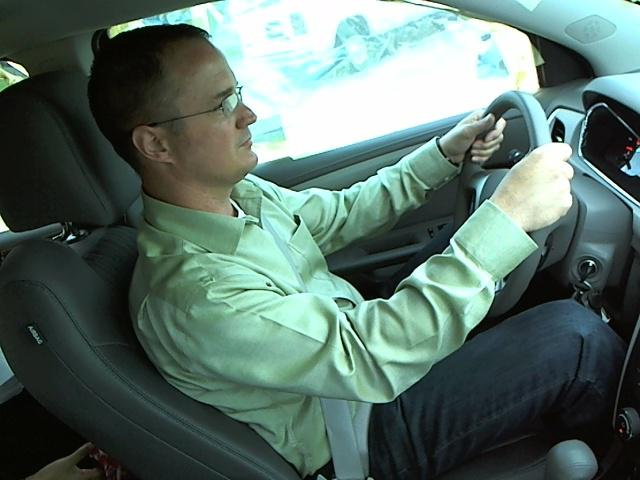

# State Farm Distracted Driver Detection
## Samuel Sherman July 2016

Given a dataset of 2D dashboard camera images, State Farm is challenging Kaggler's to classify each driver's behavior. Are they driving safe, talking on their phone (right hand), talking on their phone (left hand), texting (right hand), texting (left hand), operating radio, drinking (anything), reaching behind the seat, fixing their hair and makeup, or talking to the passenger. There is a total of 10 classes.

## Approach

The dataset came with one group of people performing the tasks listed above, labeled by their appropriate class. However, the submission dataset was larger with a different group of people. Originally, a simple convolutional model architecture was built and applied to the dataset. It performed well on hold out data, but failed to account for different drivers in the images. So, the algorithm was changed to split the hold out data by driver. In this case, I am finding the optimal performance on a dataset of unforeseen drivers, which provides me an accurate measure of performance on the submission dataset. This improved performance. However, there was still a problem. The dataset is small. Furthermore, the dataset contains images of the same people doing practically the same thing, which would imply little diversity and less room for learning. Two different images of the class "safe" are shown below.




Considering this, I decided to take an approach more robust at gathering information from smaller datasets.

Transfer learning is a technique that takes information built on neural networks for different datasets. By using information from a large dataset of images it can better derive new information from your current task. There is a correlation between what is previously learned and what it needs to learn.

[Inductive Transfer](https://en.wikipedia.org/wiki/Inductive_transfer)


## Model Architecture

### Convolutional Neural Networks

Convolutional neural networks work similarly to regular fully connected networks but take advantage of how image data is stored. The neurons, in this case, are arranged in multiple dimensions. This allows for more efficient computation and processing of images. The neural network will perform transformations and downsampling (pooling) for a desired number of convolutional layers. Finally, it will flatten the data and pass it through a fully connected network to arrive at the desired number of classifications.


### VGG Neural Network

Developed by the [Visual Geometry Group](http://www.robots.ox.ac.uk/~vgg/research/very_deep/) at the University of Oxford, the VGG16 model provides the architecture for a 37-layer deep convolutional neural network, as well as the pre-trained model weights.


With a little model "surgery", this architecture can be adjusted to fit other image related tasks. This can be done in two ways. If you desire to adjust the image size below 224x224x3, then the full architecture cannot be used. You must implement the following code after final layer of the convolutional portion of the network.
```python
import h5py

weights_path = 'vgg16_weights.h5'

f = h5py.File(weights_path)
for k in range(f.attrs['nb_layers']):
    if k >= len(model.layers):
        # we don't look at the last (fully-connected) layers in the savefile
        break
    g = f['layer_{}'.format(k)]
    weights = [g['param_{}'.format(p)] for p in range(g.attrs['nb_params'])]
    model.layers[k].set_weights(weights)
f.close()
```
This will load the model weights for the convolutional portion and will cut off the fully-connected (MLP) portion of the neural network, which can then be rebuilt however you desire. Assuming you go through appropriate steps in fine tuning, this should yield very good performance. However, for optimal performance, the original architecture is ideal.

The original model architecture will require 224x224x3 sized images. All that will be required for altering the model is to remove the last layer and replace it with the number of classes appropriate for your task. For the lasted version of Keras, a couple of extra lines will be needed as well.
```python
model.add(Dense(1000, activation='softmax'))
model.load_weights('vgg16_weights.h5')

model.layers.pop() # Get rid of the classification layer
model.outputs = [model.layers[-1].output]
model.layers[-1].outbound_nodes = []
model.add(Dense(10, activation='softmax'))
```
This will yield optimal performance and is the final model used for the State Farm Distracted Driver Competition.

## Cross-Validation

The best log loss score was achieved by averaging the predictions of 15 K-folds for cross-validation and using 15 nb_epoch (backpropagation). This was where the performance plateaued.

## Efficiency

To improve the efficiency of the model it is suggested to use GPU's, as they provide the most robust performance of neural networks. Additionally, a g2.8xlarge EC2 instance on AWS was used. Keras does not currently allow models to be run on multiple GPU's. However, if you are performing multiple K-folds, then you can run 4 models at a time, using all four GPU cores. 
